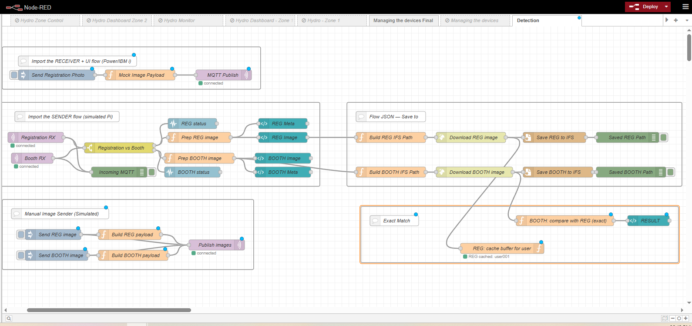
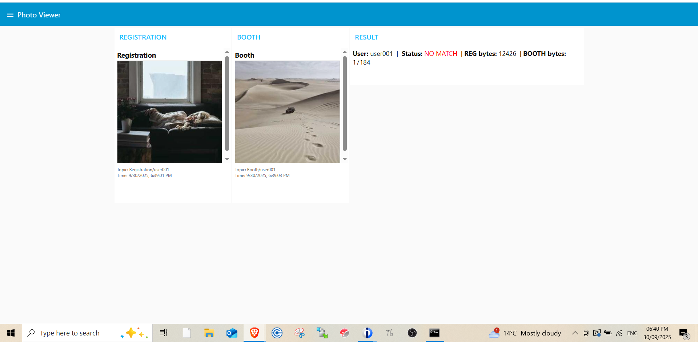

# Image Registration & Verification Flow

This Node-RED project demonstrates a simple image verification pipeline using MQTT and a dashboard.

## Overview
- A registration (REG) image is captured and cached.
- A booth (BOOTH) image is later received.
- The two images are compared byte-for-byte.
- Result (MATCH, NO MATCH, or NO REGISTRATION) is displayed on the Node-RED Dashboard.

## Features
- MQTT-based image transfer between simulated Pi and IBM i / Power system.
- Real-time result display in a dashboard UI.
- Simple buffer-based verification (can be extended with AI/face recognition).

## Setup
1. Import the provided `flows.json` into your Node-RED editor.
2. Configure MQTT broker connection (update host, port, and topics if needed).
3. Deploy the flow.
4. Use the inject nodes to send test REG/BOOTH images.

## Repository Contents
- `flows.json` → Node-RED flow file.
- `1.PNG` → Example Registration image.
- `detection.PNG` → Example Node-RED flow screenshot.
- `iugien 4.PNG` → Example Booth image.
- `README.md` → Project documentation.

## Example Flow and Dashboard

### Node-RED Flow

### Registration Image

### Booth Image

### Dashboard Result

## Future Enhancements
- Replace exact buffer comparison with AI/Face recognition.
- Add database support for multi-user verification.
- Enhance dashboard with more detailed metadata.

---

Author: Meena Chand  
LinkedIn: [https://www.linkedin.com/in/meena-chand-74805a214/](https://www.linkedin.com/in/meena-chand-74805a214/)  
GitHub: [https://github.com/meena108](https://github.com/meena108)
